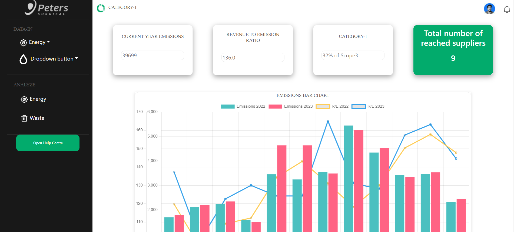
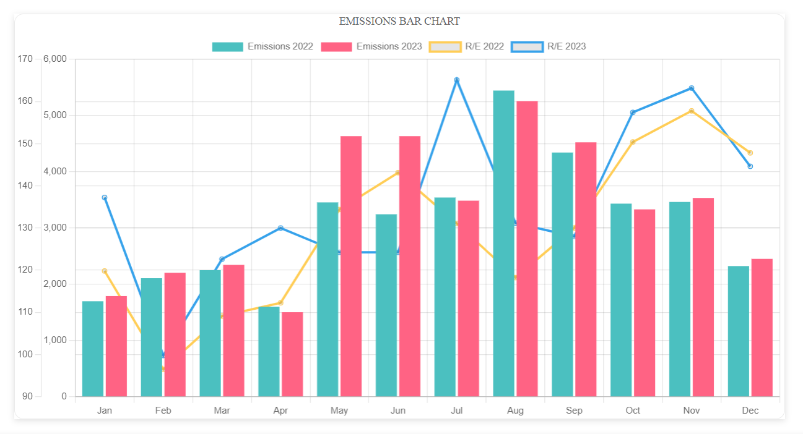
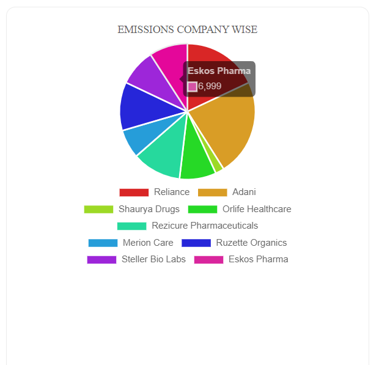
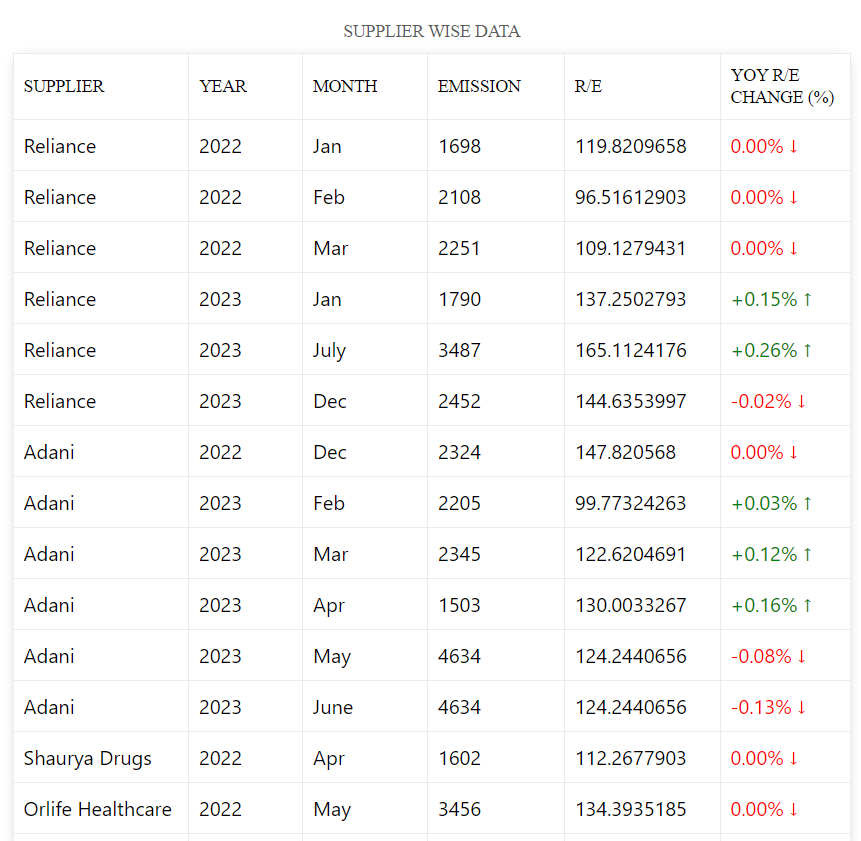
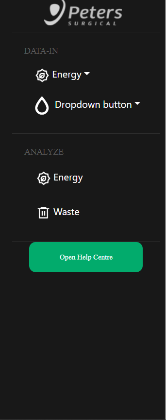

# Emission Tracking Application

## Overview

The Emission Tracking Application is designed to visualize and analyze emissions data from various suppliers. It provides insightful visualizations such as bar charts, pie charts, and tables to help users understand emission trends and revenue details.

## Dataset

The application utilizes a dataset containing information about suppliers, emissions (in CO2e), revenue (in INR), and other metrics. The dataset is used to generate various visualizations, allowing users to gain insights into environmental impact and financial performance.

XLSX File Path : https://docs.google.com/spreadsheets/d/1irt4s3lBjdbR74fuxsa3Q0u6Pm5rQDMUcnyQ8InnzaQ/edit#gid=0

## Screenshots

Screenshots are available in the respective sections.

## Functionality

The application performs the following key functionalities:

1. **Bar Chart**: Displays monthly emissions for each supplier, with unique colors for each supplier. The emissions are scaled from 0 to 9000 with an interval of 1000.

Screenshot:

2. **Pie Chart**: Illustrates the distribution of emissions based on companies, with each supplier represented by a unique color.

Screenshot:

3. **Table**: Generates a detailed table summarizing emission, revenue, and Year-over-Year (YOY) changes for each supplier per month. The table includes percentage changes and arrow indicators.

Screenshot:

4. **Dropdown**: Allows users to select specific suppliers for focused analysis.

Screenshot:

## Getting Started

1. Clone the repository.
2. Install dependencies using `npm install`.
3. Start the application using `npm start`.

## Technologies Used

- React
- Chart.js
- Other relevant technologies
